# 🚀 App Delivery - Experiência Completa e Simplificada  

Bem-vindo(a) ao **App Delivery**, um aplicativo desenvolvido para revolucionar a forma como pedidos são realizados e gerenciados. Criado com foco na usabilidade e eficiência, este projeto oferece uma experiência completa desde o login até a entrega final.  

Apesar de ainda estar em desenvolvimento (falta implementar o meio de pagamentos e corrigir alguns detalhes de UI), estou empolgado com os resultados obtidos até agora!  

---

## 🌟 Funcionalidades Principais  

✅ **Autenticação Rápida e Segura:** Login e cadastro integrados ao Firebase.  
✅ **Integração com Google Maps:** Captura automática da localização para facilitar a entrega.  
✅ **Troca de Endereço Automática:** Utilização de API de CEP para atualização prática.  
✅ **Carrinho de Compras Inteligente:** Ajuste dinâmico do total do pedido.  
✅ **Favoritos:** Adicione produtos favoritos para acesso rápido.  
✅ **Histórico Completo de Pedidos:** Consulte todos os pedidos realizados.  
✅ **Filtros e Busca Eficientes:** Encontre pedidos facilmente.  
✅ **Cálculo Automático de Taxa de Entrega:** Baseado na localização do usuário.  
✅ **Notificações:** Status do pedido atualizado via Firebase Cloud Messaging.  
✅ **Troca de Senha no App:** Gerenciamento seguro e simplificado.  
✅ **Painel Administrativo:** Gerencie e atualize pedidos em tempo real.  
✅ **Atualização de Status em Tempo Real:** Transparência e confiança para o usuário.  
✅ **Direcionamento via Google Maps:** Guia o entregador até o local da entrega.  
✅ **Impressão de Histórico em PDF:** Exporte pedidos com facilidade.  
✅ **Checkout de Pagamento:** (Em andamento) Conclusão do pedido com mais praticidade.  

---

## 🔧 Tecnologias Utilizadas  

### **Principais Ferramentas e APIs**  
- **Kotlin/Java**: Linguagem de desenvolvimento.  
- **Firebase**: Autenticação, Firestore, Realtime Database e Cloud Messaging.  
- **Google Maps API**: Localização e navegação integradas.  
- **API de CEP**: Busca e preenchimento automático de endereços.  
- **Room**: Persistência local eficiente.  
- **Hilt/Dagger**: Injeção de dependências para código modular e escalável.  
- **Retrofit e OKHttp**: Comunicação com APIs externas.  
- **Glide**: Carregamento rápido e eficiente de imagens.  
- **SharedPreferences**: Armazenamento local de configurações simples.  

---

## 🎨 UI e Experiência do Usuário  

- **Android Jetpack Components**: ViewModel, LiveData e Lifecycle para gerenciar estados de forma robusta.  
- **Bibliotecas de Interface:**  
  - `CircleImageView` para imagens de perfil personalizadas.  
  - `ImageSlideshow` para uma experiência visual cativante.  
  - `Material Components` para um design moderno e responsivo.  

---

## 🌱 Aprendizados e Destaques  

Durante o desenvolvimento deste projeto, aprimorei minhas habilidades em:  
- **Arquitetura MVVM:** Organização clara e escalável do código.  
- **Integração com APIs Externas:** Comunicação fluida entre o app e serviços externos.  
- **Persistência Local:** Uso eficiente do Room e SharedPreferences.  
- **Firebase:** Uso avançado de recursos como Firestore e Realtime Database.  
- **Google Maps API:** Implementação de funcionalidades de localização e navegação.  
- **UI Responsiva:** Design limpo e focado na experiência do usuário.  

---

## 🎥 Demonstração  

### 📽 Vídeo do App em Execução  

<p align="center">
  <video width="400" controls>
    <source src="https://user-images.githubusercontent.com/.../video.mp4" type="video/mp4">
    Seu navegador não suporta a exibição de vídeos.
  </video>
</p>  

### 🖼 Capturas de Tela  

<p align="center">
  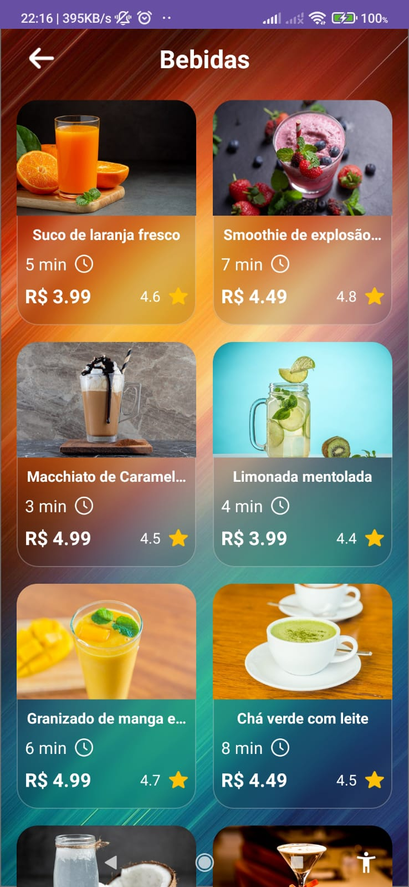
  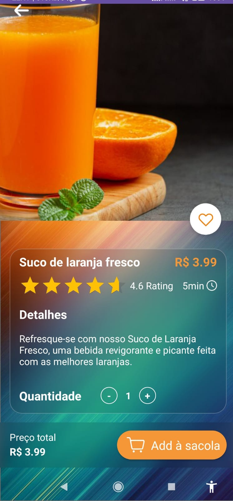
  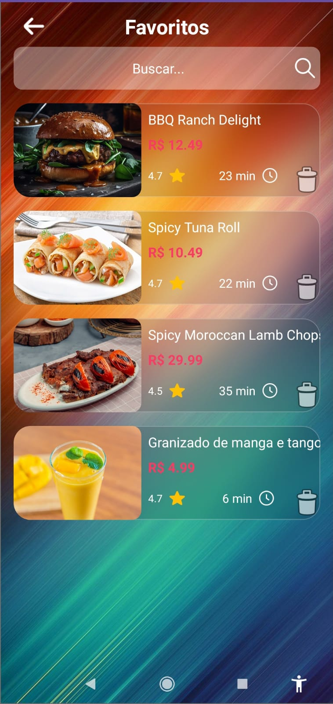
  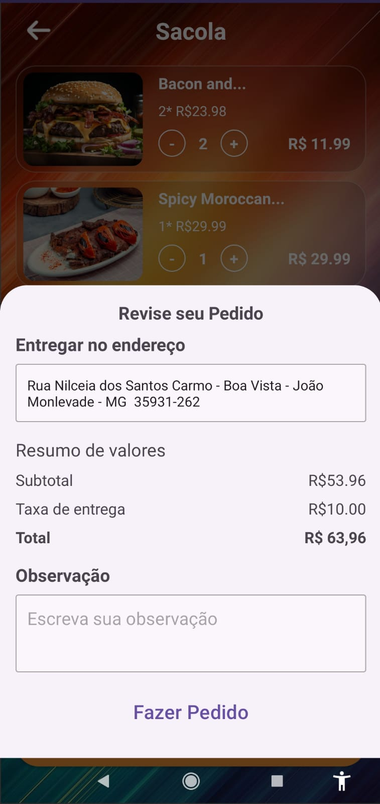
  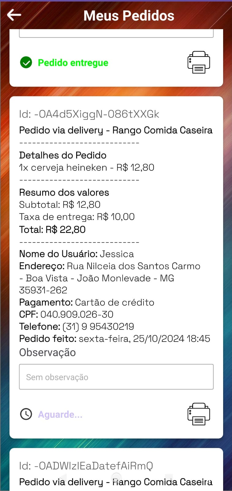
  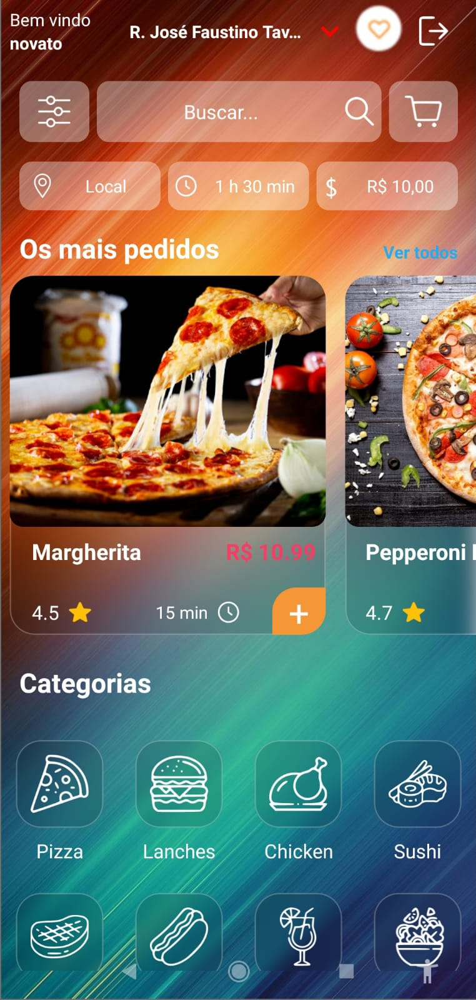
  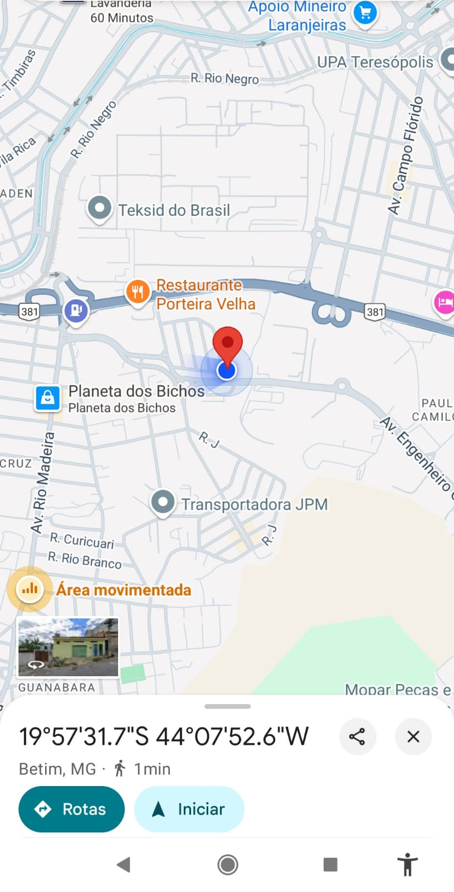
  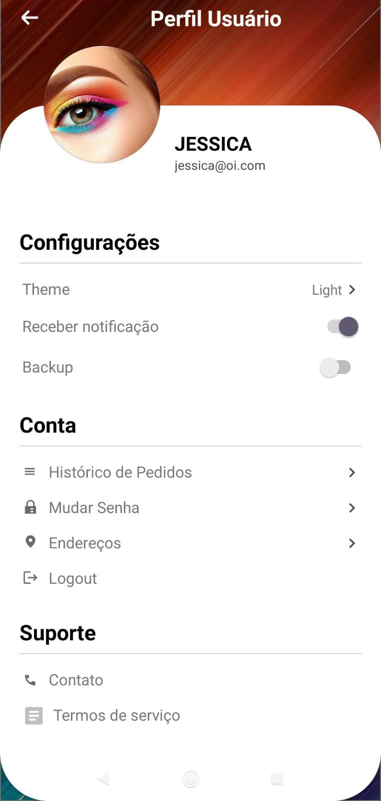
   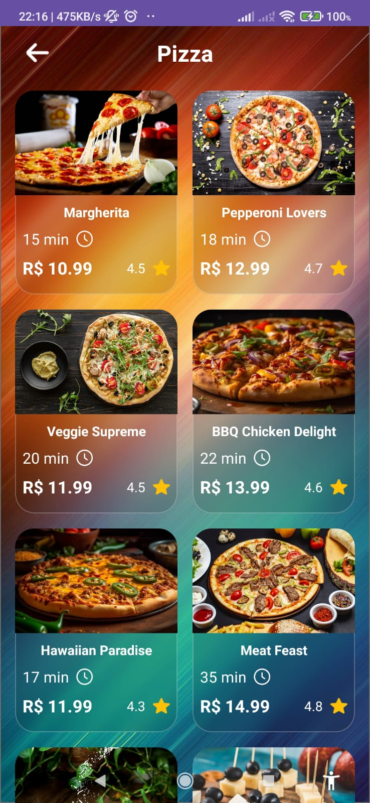
  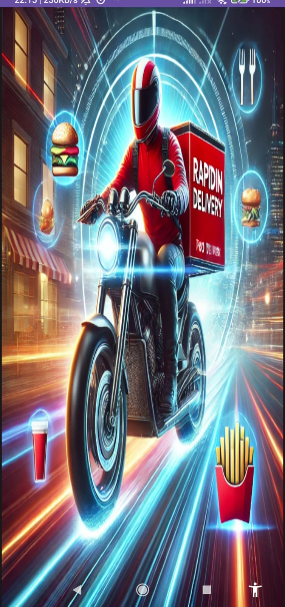
  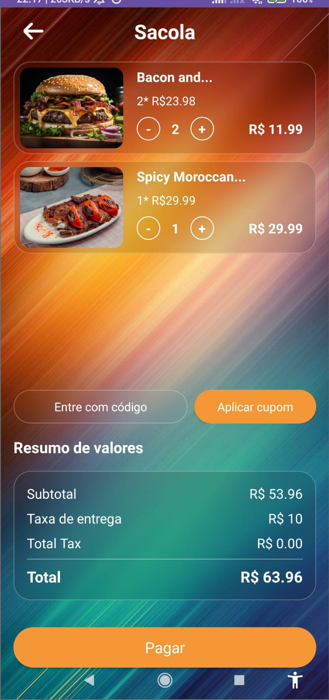
</p>  

---

## 🔄 Como Executar o Projeto  

1. Clone o repositório:  

   ```bash
   git clone https://github.com/seuusuario/AppDelivery.git
   ```  

2. Abra o projeto no Android Studio.  
3. Configure o SDK e dependências corretamente.  
4. Execute no emulador ou dispositivo físico.  

---

## 📢 Contato  

Se você se interessou pelo projeto ou deseja discutir ideias de desenvolvimento Android:  

- **LinkedIn:** [Seu Nome](https://linkedin.com/in/seunome)  
- **E-mail:** seuemail@exemplo.com  

Agradeço por explorar este projeto! Espero que ele inspire novas ideias e contribua para sua jornada no desenvolvimento Android. 🚀  

---

